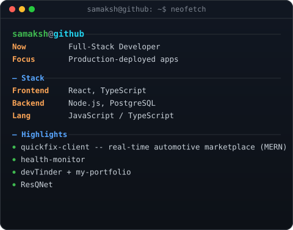

[](#)

<div align="center">

[](https://www.linkedin.com/in/samakshg11)
[](mailto:samakshgarg2005@gmail.com)
[](https://github.com/Samakshg11)

[](#)

[](#)
[](#)
[](#)

</div>

<br/>

<div align="center">
<table>
<tr>
<td valign="top"></td>
<td valign="top"></td>
</tr>
</table>
</div>

<br/>

## 🧑‍💻 About Me

```
const samaksh = {
  role: "Full-Stack Developer",
  education: "B.Tech CSE @ Lovely Professional University",
  stack: ["React", "TypeScript", "Node.js", "PostgreSQL", "MongoDB"],
  currentlyBuilding: "Production apps with hybrid SQL/NoSQL architecture",
  currentlyLearning: ["System Design", "Go", "Kafka"],
  funFact: "Migrated a live production app to TypeScript end-to-end",
  openTo: ["Internships", "Full-Time SDE Roles", "Collaborations"]
};
```

- 🎓 Pursuing **B.Tech in Computer Science Engineering** at LPU (CGPA: 7.50)
- 🛠️ Comfortable across the full stack — PostgreSQL/MongoDB schemas, React UIs, JWT-secured REST APIs
- 🚀 Built and deployed three production-grade full-stack applications, one live in production
- 📈 Strengthening backend architecture, system design, and distributed systems fundamentals
- 🤝 Open to internships, full-time SDE roles, and collaborative open-source work

<br/>

## 🧰 Tech Stack

**Languages**


**Frontend**


**Backend & APIs**


**Databases**


**Cloud & Tools**


<br/>

## 🚀 Featured Projects

<table>
<tr>
<td width="50%" valign="top">

### 🩺 Vital Watch
**AI-Driven Personal Health Ecosystem**

Architected a hybrid storage system — PostgreSQL for user records, MongoDB for real-time biometric streams — integrated with Gemini LLM + RAG achieving ~90% sleep prediction accuracy.

- Real-time biometric pipeline (HR, SpO2, temperature) with sub-second latency via Socket.io
- Automated clinical report generation with jsPDF and PostgreSQL-backed auth
- Interactive React + GSAP dashboard with JWT-secured endpoints

`React` `Node.js` `PostgreSQL` `MongoDB` `Gemini AI`

[GitHub →](https://github.com/Samakshg11)

</td>
<td width="50%" valign="top">

### 💬 Dev Tinder
**Full-Stack Developer Networking Platform**

TypeScript-migrated, swipe-based networking platform deployed live in production.

- Live at [devtinder.site](https://devtinder.site) on AWS EC2 with Nginx
- JWT-secured auth, containerized with Docker for scalable deployment
- Real-time chat and connection status across 100+ users

`TypeScript` `React` `Node.js` `Docker` `AWS`

[GitHub →](https://github.com/Samakshg11) · [Live Demo →](https://devtinder.site)

</td>
</tr>
<tr>
<td width="50%" valign="top">

### 🔧 Quick Fix
**Real-Time Automotive Service Marketplace**

Multi-role platform with real-time GPS tracking and proximity-based mechanic matching.

- Reduced database latency by 60%+ using Redis caching
- Cut user wait time by 40%+ with Instant Assistance workflow
- Real-time chat and live tracking via Leaflet and Socket.io across 100+ users

`React` `Node.js` `MongoDB` `Redis` `Socket.io` `Leaflet`

[GitHub →](https://github.com/Samakshg11)

</td>
<td width="50%" valign="top">

📌 More projects on my [pinned repositories](https://github.com/Samakshg11?tab=repositories) — auto-updates below.

</td>
</tr>
</table>

<br/>

## 📊 GitHub Analytics

<div align="center">



<br/><br/>


</div>

<br/>

## 🐍 Contribution Snake

<div align="center">


</div>

<br/>

## 🎓 Education

| Institution | Degree | Duration | Score |
|---|---|---|---|
| Lovely Professional University, Phagwara | B.Tech, Computer Science & Engineering | Aug 2023 – Present | CGPA: 7.50 |
| St. Peters School, Kichha | Intermediate | Apr 2021 – Mar 2023 | 73.4% |
| St. Peters School, Kichha | Matriculation | Apr 2020 – Mar 2021 | 89.8% |

<br/>

## 🤝 Let's Connect

<div align="center">

[](https://www.linkedin.com/in/samakshg11)
[](mailto:samakshgarg2005@gmail.com)
[](https://github.com/Samakshg11)

### ⭐ If you find my work interesting, consider starring my repositories!

*Open to internships, full-time SDE roles, and collaborative projects — feel free to reach out.*

</div>

[](#)
